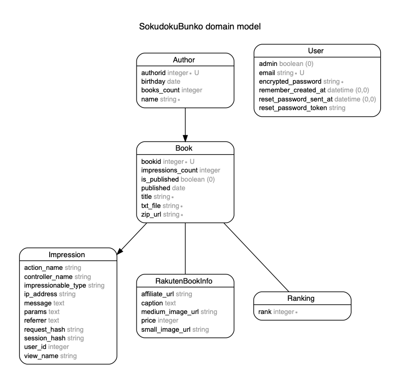

# README
そくどく文庫は、本を読むのが遅い人でも楽に本を読む速度が早くなるサイトです📖


- Ruby 2.6.3
- Rails 5.2.3

## ER図


### デプロイ手順
1. developから **release/[1-9].[0-9].[0-9]** ブランチを作成

2. リリースするブランチを **config/deploy.rb** 10行目に記述(developから切ったブランチ)
    ```
    set :branch, 'release/1.0.0' #ここにリリースするブランチ名を書く
    ```

3. リリースブランチをGitHubにPush

4. AWSで不要なファイルを削除（現在のみ）
    ```
    rm -rf shared/public/assets
    cat current/tmp/pids/unicornd.pid
    kill -9 unicorn.pid
    rm current/tmp/pids/unicornd.pid
    rm -rf release
    rm -rf current
    ```

5. デプロイを実行  
capistranoでデプロイ
    ```
    bundle exec cap production deploy
    ```

6. http://13.113.97.152 でデプロイが正常に出来ているか確認

### 管理画面へのログイン
- URL： http://13.113.97.152/admin
- Email： 自分のメールアドレス
- Password： パスワード
